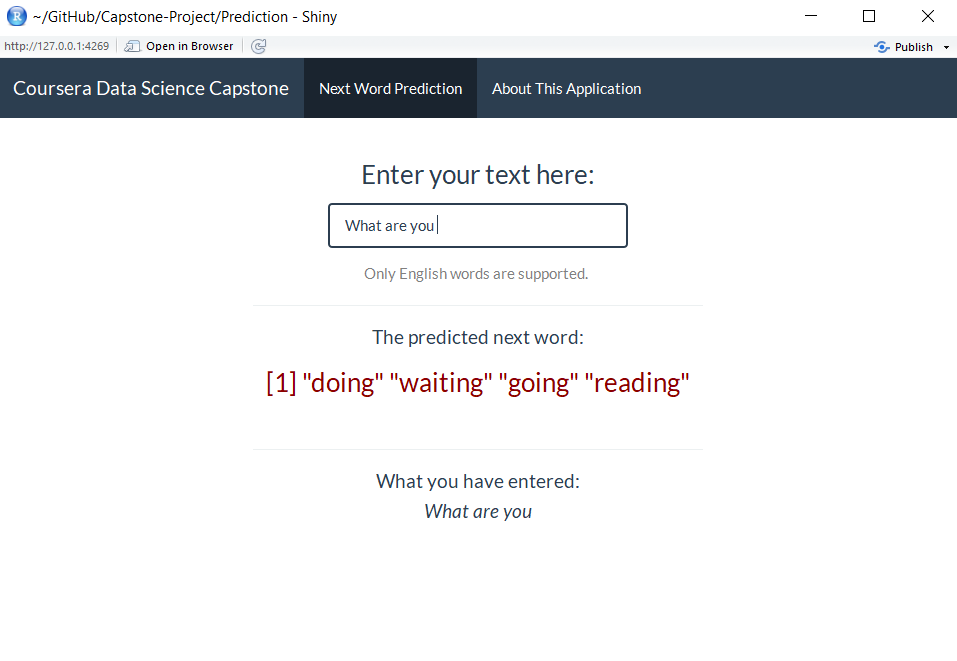
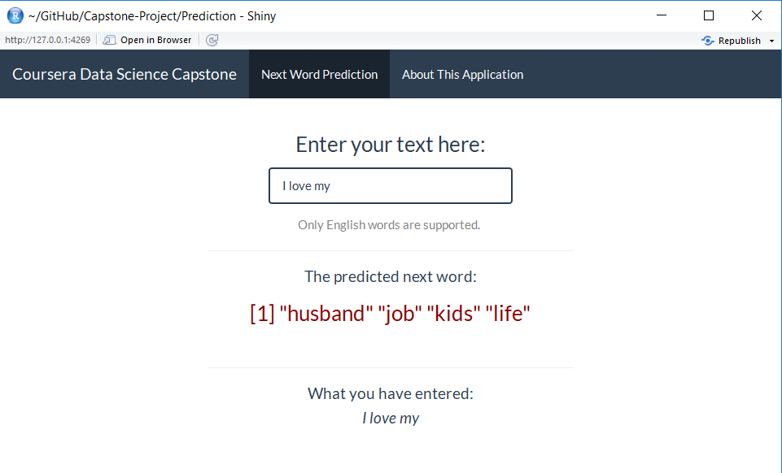

PredictNextWord_Presentation
========================================================
author: MvL
date: 2017-11-23
autosize: true

Pitch Presentation My App
========================================================

For my app go to <https://mvlunenburg.shinyapps.io/prediction_nextword/>.

Content
- Why this app is usefull
- How the app was build
- Examples
- Link to app

Why this app is usefull
========================================================
Predicting next word in phrase

This app is created to predict the next possible words in a phrase of max 5 words based on the past few words in the phrase. It is especially designed for creating short sentences for non-native speaking people.  When learning a language it can be difficult to formulate sentences. For example people from abroad trying to integreate and learn the English language. Therefore this app gives them the opportunity to predict what would be a logical next word in the phrase. 

How the app was build

My app was build using R studio using shiny. The dataset underlying this app is kindly provided by SwiftKey and contained sentences from English blogs, news articles and twitter messages. Therefore the predicted next word in the sentence has more formal and more informal* suggestions.
Profinaty is removed from the data and will not be suggested.

In the next slides some examples will be presented.

Slide with example 1
========================================================

Slide with example 2
========================================================

My App
========================================================

Thanks for viewing and good luck reviewing.

Here is the link to my app: <https://mvlunenburg.shinyapps.io/prediction_nextword/>.

Thanks!

